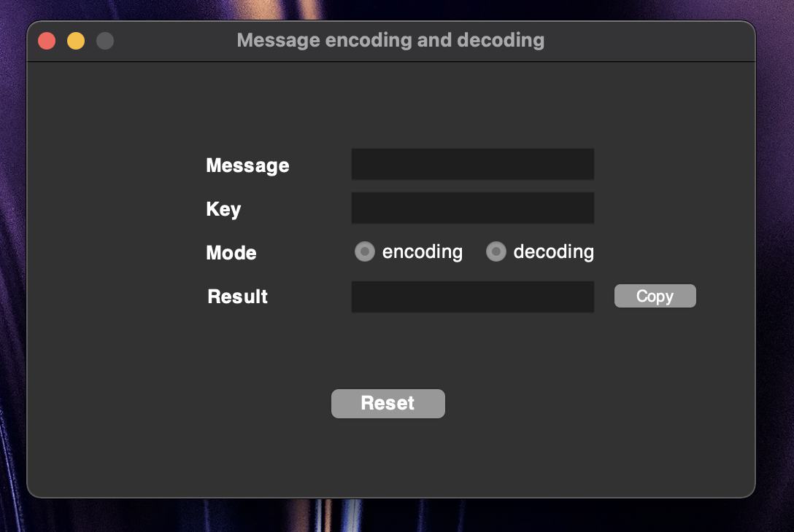
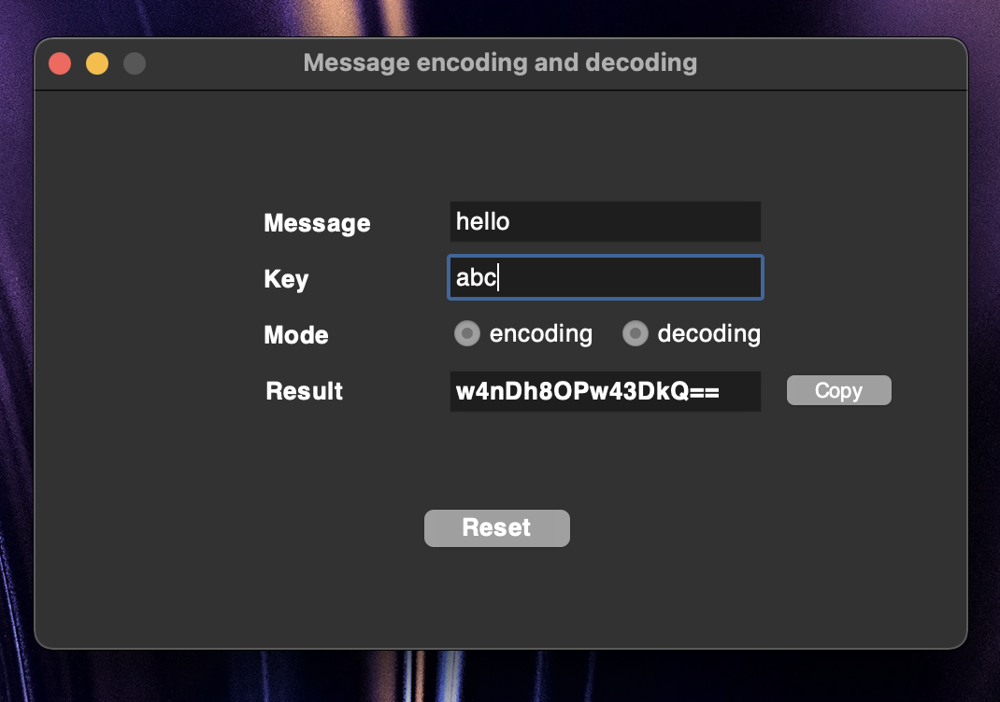
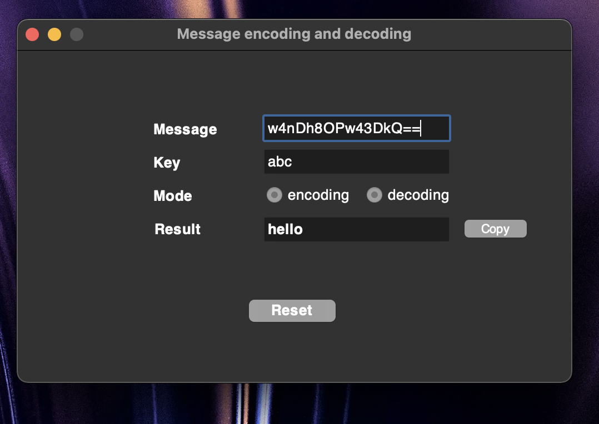

# App that lets you encode and decode messages with key with GUI built in Python-tkinter

## Table of Contents
* [Technologies Used](#technologies-used)
* [Features](#features)
* [Screenshots](#screenshots)
* [Setup](#setup)
* [Usage](#usage)
* [Room for Improvement](#room-for-improvement)
* [Contact](#contact)

## Technologies Used
- Python 3.9
- Python built-in tkinter library
- Python base64 library

## Features
- Encoding messages
- Decoding messages

## Screenshots

<!-- If you have screenshots you'd like to share, include them here. -->

## Setup
You have to have installed Python 3.x and base64 via:
`pip install pybase64`

## Usage
Two persons or more need to have this app on their computers.
Create your key you and your receiver will use and remember it.

After opening app, if encoding:
1. Write a message
2. Write the key
3. Click encoding
4. Copy your encoded message from 'Result' place and send it to someone

If decoding:
1. Put a encrypted message you received
2. Write the key
3. Click decoding
4. Read your decrypted message from 'Result' place

## Room for Improvement

To do:
- Option that allows to directly send encrypted message to someone's mail, option to log in to your mail and to specify receiver's mail

## Contact
Mail: michvlbbb@gmail.com

<!-- Optional -->
<!-- ## License -->
<!-- This project is open source and available under the [... License](). -->

<!-- You don't have to include all sections - just the one's relevant to your project -->
